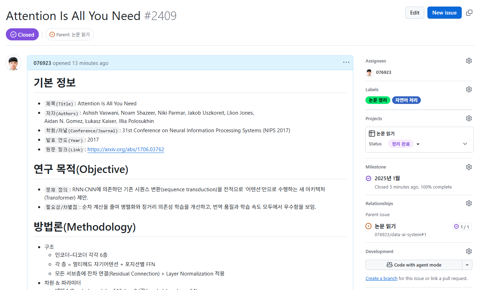
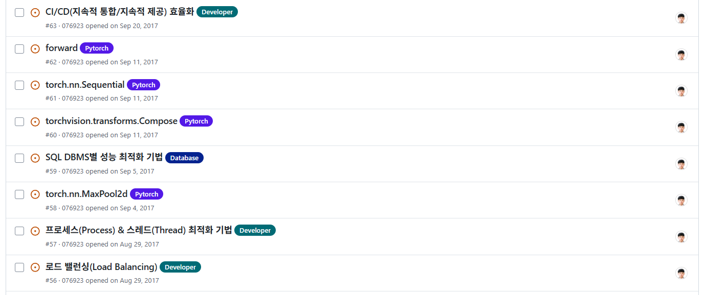

# 논문 쉽게 읽고 정리하기

연구 논문은 새로운 아이디어와 기술을 가장 직접적으로 접할 수 있는 통로이다. 그러나 처음 논문을 접하는 독자에게는 방대한 분량과 낯선 용어, 복잡한 수식이 높은 장벽처럼 다가온다.

논문 읽기에서 중요한 것은 모든 세부 사항을 처음부터 끝까지 이해하려는 태도가 아니라, 핵심 내용을 빠르게 파악하고 필요할 때 집중적으로 파고드는 전략이다. 이 장에서는 논문을 보다 쉽게, 그리고 효율적으로 읽기 위한 단계적 접근 방법을 정리한다. 책 4장의 각 응용 분야 절 말미에 있는 「필수 논문」(4.1.5 자연어 처리, 4.2.5 오디오 처리, 4.3.5 컴퓨터 비전, 4.4.5 강화 학습, 4.5.5 추천 시스템)을 읽을 때 이 가이드를 함께 활용하면 좋다.

<br>

## 1. 가독성 확보

논문은 대부분 PDF 형식으로 제공된다. 그러나 글자가 작거나 수식이 깨지는 경우가 있어, 본격적인 독해에 앞서 읽기 환경을 정비하는 것이 우선이다. 가장 간단한 방법은 arXiv의 HTML 뷰어를 활용하는 것이다. PDF보다 글자 크기 조절이 자유롭고, 텍스트 검색과 복사가 훨씬 편리하다.

[ar5iv](https://ar5iv.org/) 서비스를 사용하면 LaTeX 기반 논문을 HTML5 웹페이지로 변환할 수 있다. 이 경우 수식이 깔끔하게 표시되고, 모바일 환경에서도 읽기 쉬워진다. 예를 들어, 「Attention Is All You Need」 논문의 주소에서 `x`를 `5`로 바꾸면 HTML5 형식으로 확인할 수 있다.

- 원본: https://arxiv.org/abs/1706.03762
- 변환: https://ar5iv.org/abs/1706.03762


읽는 과정에서는 `핵심 기여(Claim)`, `근거(Evidence)`, `한계(Limit)`를 <b>색상</b>이나 <b>기호</b>로 구분해 표시해 두면 나중에 내용을 다시 파악할 때 유용하다. 논문은 처음부터 끝까지 따라가기보다, 큰 그림을 잡은 뒤 그림과 표를 훑고, 마지막으로 세부 수식에 들어가는 순서가 효율적이다.

<br>

## 2. Keshav의 Three-pass 방법

S. Keshav(2007)가 「How to Read a Paper」에서 제안한 Three-pass 방법은 많은 연구자가 따르는 효율적인 논문 독해 전략이다. 한 번에 모든 내용을 이해하려 하기보다, 세 번에 걸쳐 점진적으로 깊이를 더해 가는 방식이다.

**1차 패스: 큰 그림 잡기** (5~10분)

1. 제목, 초록, 결론만 읽는다.
2. 그림·표를 훑어보며 어떤 문제를 다루고, 어떤 결과를 냈는지 대략적으로 파악한다.
3. 이 단계의 목표는 “이 논문을 계속 읽을지 말지”를 결정하는 것이다.

**2차 패스: 구조와 기여 확인** (약 1시간)

1. 서론, 주요 방법 설명, 실험 결과 부분을 좀 더 꼼꼼히 읽는다.
2. 생소한 세부 수식이나 증명은 건너뛰고, 논문이 주장하는 핵심 기여와 근거에 집중한다.
3. 이 단계의 목표는 “논문의 핵심 아이디어와 실험적 증거”를 파악하는 것이다.

**3차 패스: 세부 분석** (수 시간)

1. 필요한 경우에만 전체를 정독하면서 수식, 알고리즘, 증명까지 검토한다.
2. 자신의 연구에 직접 응용하거나 재현할 때 필요한 세부 구현·실험 설정을 꼼꼼히 확인한다.
3. 이 단계의 목표는 “논문을 재현하고 비판적으로 평가할 수 있는 수준까지 이해”하는 것이다.

<br>

## 3. 핵심 내용 빠르게 파악하기

논문을 읽을 때 가장 먼저 확인해야 할 것은 글의 전체 구조이다. 모든 문장을 세밀하게 이해하지 못하더라도, 다음 다섯 가지 질문에 답할 수 있다면 논문의 절반은 파악한 셈이다. 특히 초록(Abstract), 그림(Figure), 표(Table)만 살펴보아도 이 질문들에 상당 부분 답할 수 있다.

1. **연구 질문**: 이 논문은 어떤 문제를 해결하려 하는가?

2. **핵심 기여**: 기존 연구와 비교해 어떤 점이 새롭고 차별적인가?

3. **방법 요약**: 제안된 방법의 핵심 아이디어는 무엇인가?

4. **실험 설정**: 어떤 데이터세트와 평가 지표를 사용했는가?

5. **주요 결과** : 기존 방법보다 얼마나 개선되었는가?

<br>

## 4. LLM을 활용한 보조 읽기

대규모 언어 모델(LLM)은 논문 읽기의 강력한 보조 도구가 되었다. ChatGPT, Claude, Gemini뿐 아니라 Elicit, Semantic Scholar의 확장 기능 등도 널리 쓰이고 있다. 그러므로 논문 PDF를 업로드하고 <b>“연구 질문 / 기여 / 방법 / 데이터 / 결과 / 한계 순으로 요약해 달라”</b>고 요청할 수 있다.

수식이나 코드가 난해하다면 “이 부분을 고등학교 수학 수준으로 풀어 달라”고 지시할 수 있으며, 표나 그림의 의미를 한 문단으로 설명해 달라고 요구할 수도 있다.

단, LLM이 제공하는 요약에는 오류가 섞일 수 있다. 따라서 이 도구는 빠른 이해를 돕는 보조 수단으로 활용하되, 반드시 원문과의 대조 과정을 병행해야 한다.

<br>

## 5. 사실 검증

LLM을 통한 요약과 해석은 편리하지만, 그대로 신뢰하기에는 위험하다. 사실 검증은 필수적인 단계다. 그러므로 동일한 질문을 여러 LLM에 던져 교차 검증한다.

[Trending Papers](https://huggingface.co/papers/trending)와 같은 서비스에서 해당 논문의 성능 수치와 벤치마크 결과를 확인한다. 또한, 원문 PDF의 표와 부록을 직접 확인해 LLM의 답변이 실제와 일치하는지 점검한다.

논문을 읽을 때 스스로에게 “이 수치가 정말 원문에 존재하는가?”라는 질문을 반복적으로 던지는 습관이 중요하다.

<br>

## 6. 코드와 재현

논문 이해는 단순히 글을 읽는 것을 넘어, 실제 성능을 재현해 보는 과정에서 완성된다. arXiv 페이지의 `Code` 배지나 논문 속 `GitHub` 링크를 통해 구현 코드를 찾는다.

`README.md` → `requirements.txt` → `train.py` 순으로 구조를 파악하며 실행 환경을 설정한다. 처음에는 작은 데이터세트로 간단한 테스트를 돌려보는 것이 효율적이다.

낯선 코드 경로가 있다면 LLM을 활용해 의사코드 형태로 설명을 받아 이해를 보완한다. 최근에는 Docker, Hugging Face Spaces, Google Colab을 통한 실행 환경 제공도 흔하므로 이를 적극 활용할 수 있다.

<br>

## 7. 기록과 지식화

논문은 읽고 나면 쉽게 잊히기 때문에 **반드시 기록으로 남겨 두는 것이 바람직하다.** 이를 위해 다음과 같은 템플릿을 참고하면 도움이 된다.

**논문 정리 템플릿**
> 1. 기본 정보

```
- 제목(Title):
- 저자(Authors):
- 학회/저널(Conference/Journal):
- 발표 연도(Year):
- 원문 링크(Link):
```
> 2. 연구 목적(Objective)
```
- 연구에서 다루는 문제 정의
- 연구의 필요성 및 기존 연구와의 차별점
```

> 3. 방법론(Methodology)
```
- 사용된 모델, 알고리즘, 데이터세트 요약
- 핵심 아이디어 및 접근 방식
```

> 4. 주요 결과(Key Results)
```
- 정량적 성능 지표(예: Accuracy, F1-score, BLEU 등)
- 정성적 평가(예: 사례 비교, 시각화 결과 등)
```

> 5. 한계와 논의(Limitations & Discussions)
```
- 제안된 방법의 한계점
- 적용 가능한 범위 및 일반화 가능성
- 후속 연구를 위한 시사점
```

> 6. 개인 메모(Personal Notes)
```
- 기억해 둘 개념 및 용어
- 다른 프로젝트에 응용할 수 있는 부분
- 추가로 읽어야 할 참고 논문
```

확실한 내용과 불확실한 내용, 추측에 불과한 부분을 구분해 기록하는 것이 중요하다. Obsidian, Notion, Zotero 같은 도구와 연동하면 장기적인 지식 관리에도 유리하다.

<br>

## 8. 정리 노트 활용

연구 논문이나 학습 내용을 기록할 때 Notion이나 GitHub Issues를 활용하면 체계적인 “개인 위키(정리 노트)”를 만들 수 있다. 특히 GitHub Issues는 라벨링·프로젝트 관리·마일스톤·관계 설정 기능을 제공하기 때문에, 단순한 기록을 넘어 논문 관리 도구로 확장할 수 있다.





1. **Labels**: 이슈의 성격/주제 태그(자연어 처리, 논문 정리, 데이터베이스 등)
2. **Projects**: 여러 이슈를 모아 진행 중인 큰 단위 작업 관리(논문 읽기, 공모전 등)
3. **Milestone**: 특정 기한 안에 묶어서 관리(분기별, 버저닝, 챕터 단위 등)
4. **Relationships**: 연관된 이슈·PR과 연결(다른 트랜스포머 관련 논문 연결, 후속 논문 등)

정리하면, `Labels`은 태그(분야/주제/상태), `Projects`는 전체 작업 흐름(읽기/정리), `Milestone`은 시간 또는 챕터 단위 목표, `Relationships`은 논문 간 계보/연관성을 정리할 수 있다. 이렇게 관리하면 단순 메모를 넘어, <b>지식 관리 시스템(Knowledge Management System)</b>으로 발전시킬 수 있다.

<br>

**참고 자료**

- S. Keshav, "How to Read a Paper," ACM SIGCOMM Computer Communication Review, 2007. https://web.stanford.edu/class/ee384m/Handouts/HowtoReadPaper.pdf
- ar5iv: https://ar5iv.org/
- Hugging Face Papers: https://huggingface.co/papers/trending
- Papers with Code(코드 구현 및 벤치마크 탐색): https://paperswithcode.com/