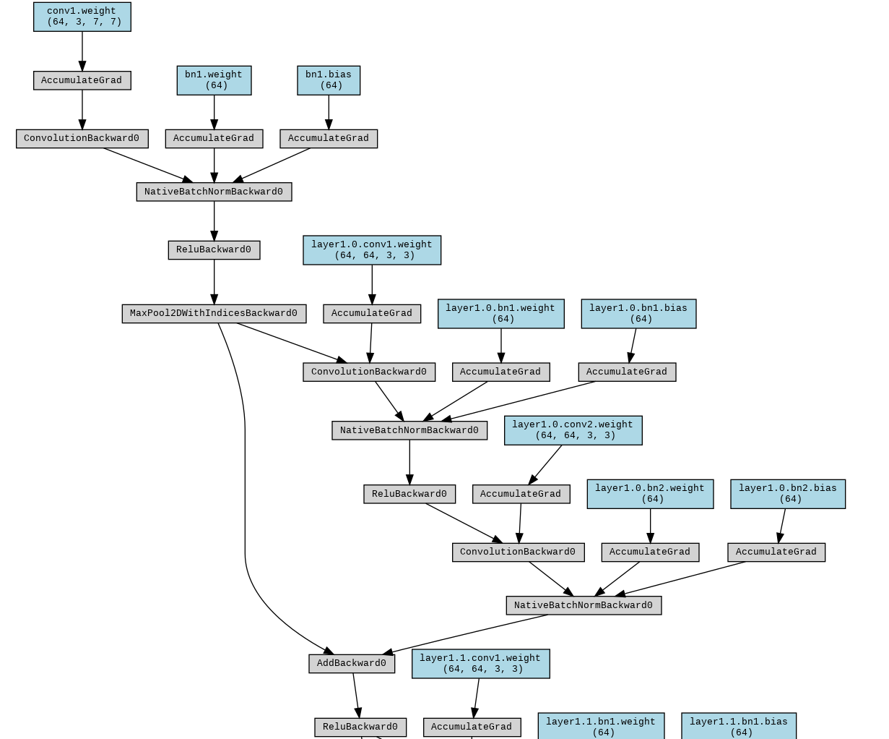

# 모델 구조 이해하기

딥러닝 모델을 제대로 활용하려면 단순히 학습시키는 것에 그치지 않고, 내부 구조를 파악하는 과정이 필요하다. 모델의 구성 요소와 흐름을 이해하면 디버깅, 성능 개선, 커스터마이징 모두 훨씬 수월해진다. 이 글에서는 모델 구조를 이해하는 대표적인 방법들을 정리한다.

> 예제는 PyTorch 2.x, torchvision 0.13 이상을 기준으로 한다. `pretrained=True` 인자는 deprecated 되었으므로 `weights=models.ResNet18_Weights.DEFAULT`와 같이 `weights` 열거형으로 사전학습 가중치를 지정한다.

<br>

## 1. 모델 구조 직접 확인하기

가장 기본적이면서도 빠른 방법은 모델을 직접 출력하는 것이다. 모듈 이름과 계층 구조를 전체적으로 확인할 수 있다. 출력 결과는 nn.Module의 계층 구조를 보여주며, 계층의 이름과 종류(Conv2d, BatchNorm, Linear 등)를 한눈에 확인할 수 있다.

**예제 코드**
```Python
import torch
from torchvision import models

model = models.resnet18(weights=models.ResNet18_Weights.DEFAULT)
print(model)
```

**출력 결과**
```
ResNet(
  (conv1): Conv2d(3, 64, kernel_size=(7, 7), stride=(2, 2), padding=(3, 3), bias=False)
  (bn1): BatchNorm2d(64, eps=1e-05, momentum=0.1, affine=True, track_running_stats=True)
  (relu): ReLU(inplace=True)
  (maxpool): MaxPool2d(kernel_size=3, stride=2, padding=1, dilation=1, ceil_mode=False)
  (layer1): Sequential(
    (0): BasicBlock(
      (conv1): Conv2d(64, 64, kernel_size=(3, 3), stride=(1, 1), padding=(1, 1), bias=False)
      (bn1): BatchNorm2d(64, eps=1e-05, momentum=0.1, affine=True, track_running_stats=True)
      (relu): ReLU(inplace=True)
      (conv2): Conv2d(64, 64, kernel_size=(3, 3), stride=(1, 1), padding=(1, 1), bias=False)
      (bn2): BatchNorm2d(64, eps=1e-05, momentum=0.1, affine=True, track_running_stats=True)
    )
    (1): BasicBlock(
      (conv1): Conv2d(64, 64, kernel_size=(3, 3), stride=(1, 1), padding=(1, 1), bias=False)
      (bn1): BatchNorm2d(64, eps=1e-05, momentum=0.1, affine=True, track_running_stats=True)
      (relu): ReLU(inplace=True)
      (conv2): Conv2d(64, 64, kernel_size=(3, 3), stride=(1, 1), padding=(1, 1), bias=False)
      (bn2): BatchNorm2d(64, eps=1e-05, momentum=0.1, affine=True, track_running_stats=True)
    )
  )
  (layer2): Sequential(
    (0): BasicBlock(
      (conv1): Conv2d(64, 128, kernel_size=(3, 3), stride=(2, 2), padding=(1, 1), bias=False)
      (bn1): BatchNorm2d(128, eps=1e-05, momentum=0.1, affine=True, track_running_stats=True)
...
  )
  (avgpool): AdaptiveAvgPool2d(output_size=(1, 1))
  (fc): Linear(in_features=512, out_features=1000, bias=True)
)
```

<br>

앞선 방법은 별도 도구 설치 없이 빠르게 구조를 파악할 수 있다. 그러나 모델이 복잡할수록 출력이 길어지고 가독성이 떨어지므로, 계층의 종류만 트리 형태로 출력하는 보조 함수를 활용하면 전체 구조를 한눈에 파악할 수 있다. `named_children()`은 직속 하위 모듈만 반환하므로, 재귀 호출로 깊이를 따라 내려가면서 계층 이름과 클래스명만 출력한다.

**예제 코드**
```Python
import torch
from torchvision import models

def print_module_tree(module, prefix=""):
    children = list(module.named_children())
    for i, (name, child) in enumerate(children):
        is_last = i == len(children) - 1
        connector = "└─ " if is_last else "├─ "
        print(f"{prefix}{connector}{name}: {child.__class__.__name__}")
        print_module_tree(child, prefix + ("   " if is_last else "│  "))

model = models.resnet18(weights=models.ResNet18_Weights.DEFAULT)
print_module_tree(model)
```

**출력 결과**
```
├─ conv1: Conv2d
├─ bn1: BatchNorm2d
├─ relu: ReLU
├─ maxpool: MaxPool2d
├─ layer1: Sequential
│  ├─ 0: BasicBlock
│  │  ├─ conv1: Conv2d
│  │  ├─ bn1: BatchNorm2d
│  │  ├─ relu: ReLU
│  │  ├─ conv2: Conv2d
│  │  └─ bn2: BatchNorm2d
│  └─ 1: BasicBlock
│     ├─ conv1: Conv2d
│     ├─ bn1: BatchNorm2d
│     ├─ relu: ReLU
│     ├─ conv2: Conv2d
│     └─ bn2: BatchNorm2d
├─ layer2: Sequential
│  ├─ 0: BasicBlock
│  │  ├─ conv1: Conv2d
│  │  ├─ bn1: BatchNorm2d
│  │  ├─ relu: ReLU
│  │  ├─ conv2: Conv2d
│  │  ├─ bn2: BatchNorm2d
│  │  └─ downsample: Sequential
│  │     ├─ 0: Conv2d
│  │     └─ 1: BatchNorm2d
│  └─ 1: BasicBlock
...
├─ avgpool: AdaptiveAvgPool2d
└─ fc: Linear
```

하위 계층까지 파라미터 형태를 함께 확인하려면 `named_modules()`를 사용한다. `named_children()`과 달리 모든 깊이의 모듈을 `layer1.0.conv1`처럼 점(.)으로 연결된 전체 경로와 함께 반환하므로, 특정 계층을 코드에서 직접 참조하거나 Forward Hook을 걸 때 필요한 이름을 확인하는 용도로 유용하다.

```Python
for name, module in model.named_modules():
    if isinstance(module, torch.nn.Conv2d):
        print(name, tuple(module.weight.shape))
```

```
conv1 (64, 3, 7, 7)
layer1.0.conv1 (64, 64, 3, 3)
layer1.0.conv2 (64, 64, 3, 3)
layer1.1.conv1 (64, 64, 3, 3)
...
layer4.1.conv2 (512, 512, 3, 3)
```

<br>

## 2. Forward Hook으로 중간 출력 확인하기

PyTorch의 `register_forward_hook`을 이용하면 각 계층의 실제 입·출력 텐서를 확인할 수 있다. 디버깅 및 중간 특징맵 분석에 유용하다.

**예제 코드**
```Python
import torch
from torchvision import models

def hook(module, input, output):
    print(module.__class__.__name__, output.shape)

model = models.resnet18(weights=models.ResNet18_Weights.DEFAULT)
handle = model.layer1[0].register_forward_hook(hook)
dummy_input = torch.randn(1, 3, 224, 224)
_ = model(dummy_input)
handle.remove()
```

**출력 결과**
```
BasicBlock torch.Size([1, 64, 56, 56])
```

<br>

## 3. torchinfo로 계층별 정보 요약

계층별 출력 텐서 크기와 파라미터 수를 확인하고 싶다면 `torchinfo` 라이브러리를 활용할 수 있다.

**설치**
```
pip install torchinfo
```

**예제 코드**
```Python
import torch
from torchvision import models
from torchinfo import summary

model = models.resnet18(weights=models.ResNet18_Weights.DEFAULT)
summary(model, input_size=(1, 3, 224, 224), verbose=2)
```

**출력 결과** 
```
==========================================================================================
Layer (type:depth-idx)                   Output Shape              Param #
==========================================================================================
ResNet                                   [1, 1000]                 --
├─Conv2d: 1-1                            [1, 64, 112, 112]         9,408
│    └─weight                                                      └─9,408
├─BatchNorm2d: 1-2                       [1, 64, 112, 112]         128
│    └─weight                                                      ├─64
│    └─bias                                                        └─64
├─ReLU: 1-3                              [1, 64, 112, 112]         --
├─MaxPool2d: 1-4                         [1, 64, 56, 56]           --
├─Sequential: 1-5                        [1, 64, 56, 56]           --
│    └─0.conv1.weight                                              ├─36,864
│    └─0.bn1.weight                                                ├─64
│    └─0.bn1.bias                                                  ├─64
│    └─0.conv2.weight                                              ├─36,864
│    └─0.bn2.weight                                                ├─64
│    └─0.bn2.bias                                                  ├─64
│    └─1.conv1.weight                                              ├─36,864
│    └─1.bn1.weight                                                ├─64
│    └─1.bn1.bias                                                  ├─64
│    └─1.conv2.weight                                              ├─36,864
│    └─1.bn2.weight                                                ├─64
│    └─1.bn2.bias                                                  └─64
│    └─BasicBlock: 2-1                   [1, 64, 56, 56]           --
...
Input size (MB): 0.60
Forward/backward pass size (MB): 39.75
Params size (MB): 46.76
Estimated Total Size (MB): 87.11
==========================================================================================
```

<br>

## 4. FLOPs / 파라미터 수 계산하기

모델 배포나 최적화 단계에서는 연산량과 파라미터 수를 수치로 파악하는 것이 중요하다. 이를 위해 `ptflops`와 같은 라이브러리를 활용할 수 있다. FLOPs와 파라미터 수를 얻어 경량화 여부를 판단하거나, 하드웨어 자원(모바일/임베디드)에 맞는지 검토할 수 있다.

**설치**
```
pip install ptflops
```

**예제 코드**
```Python
import torch
from torchvision import models
from ptflops import get_model_complexity_info

model = models.resnet18(weights=models.ResNet18_Weights.DEFAULT)
macs, params = get_model_complexity_info(model, (3, 224, 224), as_strings=True)
print(macs, params)
```

**출력 결과**
```
ResNet(
  11.69 M, 100.000% Params, 1.82 GMac, 99.828% MACs, 
  (conv1): Conv2d(9.41 k, 0.080% Params, 118.01 MMac, 6.465% MACs, 3, 64, kernel_size=(7, 7), stride=(2, 2), padding=(3, 3), bias=False)
  (bn1): BatchNorm2d(128, 0.001% Params, 1.61 MMac, 0.088% MACs, 64, eps=1e-05, momentum=0.1, affine=True, track_running_stats=True)
  (relu): ReLU(0, 0.000% Params, 802.82 KMac, 0.044% MACs, inplace=True)
  (maxpool): MaxPool2d(0, 0.000% Params, 802.82 KMac, 0.044% MACs, kernel_size=3, stride=2, padding=1, dilation=1, ceil_mode=False)
  (layer1): Sequential(
    147.97 k, 1.266% Params, 464.83 MMac, 25.466% MACs, 
    (0): BasicBlock(
      73.98 k, 0.633% Params, 232.42 MMac, 12.733% MACs, 
      (conv1): Conv2d(36.86 k, 0.315% Params, 115.61 MMac, 6.333% MACs, 64, 64, kernel_size=(3, 3), stride=(1, 1), padding=(1, 1), bias=False)
      (bn1): BatchNorm2d(128, 0.001% Params, 401.41 KMac, 0.022% MACs, 64, eps=1e-05, momentum=0.1, affine=True, track_running_stats=True)
      (relu): ReLU(0, 0.000% Params, 401.41 KMac, 0.022% MACs, inplace=True)
      (conv2): Conv2d(36.86 k, 0.315% Params, 115.61 MMac, 6.333% MACs, 64, 64, kernel_size=(3, 3), stride=(1, 1), padding=(1, 1), bias=False)
      (bn2): BatchNorm2d(128, 0.001% Params, 401.41 KMac, 0.022% MACs, 64, eps=1e-05, momentum=0.1, affine=True, track_running_stats=True)
    )
    (1): BasicBlock(
      73.98 k, 0.633% Params, 232.42 MMac, 12.733% MACs, 
      (conv1): Conv2d(36.86 k, 0.315% Params, 115.61 MMac, 6.333% MACs, 64, 64, kernel_size=(3, 3), stride=(1, 1), padding=(1, 1), bias=False)
      (bn1): BatchNorm2d(128, 0.001% Params, 401.41 KMac, 0.022% MACs, 64, eps=1e-05, momentum=0.1, affine=True, track_running_stats=True)
      (relu): ReLU(0, 0.000% Params, 401.41 KMac, 0.022% MACs, inplace=True)
      (conv2): Conv2d(36.86 k, 0.315% Params, 115.61 MMac, 6.333% MACs, 64, 64, kernel_size=(3, 3), stride=(1, 1), padding=(1, 1), bias=False)
      (bn2): BatchNorm2d(128, 0.001% Params, 401.41 KMac, 0.022% MACs, 64, eps=1e-05, momentum=0.1, affine=True, track_running_stats=True)
    )
  )
  (layer2): Sequential(
    525.57 k, 4.496% Params, 412.45 MMac, 22.596% MACs, 
    (0): BasicBlock(
      230.14 k, 1.969% Params, 180.63 MMac, 9.896% MACs, 
      (conv1): Conv2d(73.73 k, 0.631% Params, 57.8 MMac, 3.167% MACs, 64, 128, kernel_size=(3, 3), stride=(2, 2), padding=(1, 1), bias=False)
      (bn1): BatchNorm2d(256, 0.002% Params, 200.7 KMac, 0.011% MACs, 128, eps=1e-05, momentum=0.1, affine=True, track_running_stats=True)
      (relu): ReLU(0, 0.000% Params, 200.7 KMac, 0.011% MACs, inplace=True)
      (conv2): Conv2d(147.46 k, 1.261% Params, 115.61 MMac, 6.333% MACs, 128, 128, kernel_size=(3, 3), stride=(1, 1), padding=(1, 1), bias=False)
      (bn2): BatchNorm2d(256, 0.002% Params, 200.7 KMac, 0.011% MACs, 128, eps=1e-05, momentum=0.1, affine=True, track_running_stats=True)
      (downsample): Sequential(
        8.45 k, 0.072% Params, 6.62 MMac, 0.363% MACs, 
        (0): Conv2d(8.19 k, 0.070% Params, 6.42 MMac, 0.352% MACs, 64, 128, kernel_size=(1, 1), stride=(2, 2), bias=False)
        (1): BatchNorm2d(256, 0.002% Params, 200.7 KMac, 0.011% MACs, 128, eps=1e-05, momentum=0.1, affine=True, track_running_stats=True)
      )
    )
    (1): BasicBlock(
      295.42 k, 2.527% Params, 231.81 MMac, 12.700% MACs, 
      (conv1): Conv2d(147.46 k, 1.261% Params, 115.61 MMac, 6.333% MACs, 128, 128, kernel_size=(3, 3), stride=(1, 1), padding=(1, 1), bias=False)
      (bn1): BatchNorm2d(256, 0.002% Params, 200.7 KMac, 0.011% MACs, 128, eps=1e-05, momentum=0.1, affine=True, track_running_stats=True)
      (relu): ReLU(0, 0.000% Params, 200.7 KMac, 0.011% MACs, inplace=True)
      (conv2): Conv2d(147.46 k, 1.261% Params, 115.61 MMac, 6.333% MACs, 128, 128, kernel_size=(3, 3), stride=(1, 1), padding=(1, 1), bias=False)
      (bn2): BatchNorm2d(256, 0.002% Params, 200.7 KMac, 0.011% MACs, 128, eps=1e-05, momentum=0.1, affine=True, track_running_stats=True)
    )
  )
  (layer3): Sequential(
    2.1 M, 17.962% Params, 411.74 MMac, 22.557% MACs, 
    (0): BasicBlock(
      919.04 k, 7.862% Params, 180.23 MMac, 9.874% MACs, 
      (conv1): Conv2d(294.91 k, 2.523% Params, 57.8 MMac, 3.167% MACs, 128, 256, kernel_size=(3, 3), stride=(2, 2), padding=(1, 1), bias=False)
      (bn1): BatchNorm2d(512, 0.004% Params, 100.35 KMac, 0.005% MACs, 256, eps=1e-05, momentum=0.1, affine=True, track_running_stats=True)
      (relu): ReLU(0, 0.000% Params, 100.35 KMac, 0.005% MACs, inplace=True)
      (conv2): Conv2d(589.82 k, 5.046% Params, 115.61 MMac, 6.333% MACs, 256, 256, kernel_size=(3, 3), stride=(1, 1), padding=(1, 1), bias=False)
      (bn2): BatchNorm2d(512, 0.004% Params, 100.35 KMac, 0.005% MACs, 256, eps=1e-05, momentum=0.1, affine=True, track_running_stats=True)
      (downsample): Sequential(
        33.28 k, 0.285% Params, 6.52 MMac, 0.357% MACs, 
        (0): Conv2d(32.77 k, 0.280% Params, 6.42 MMac, 0.352% MACs, 128, 256, kernel_size=(1, 1), stride=(2, 2), bias=False)
        (1): BatchNorm2d(512, 0.004% Params, 100.35 KMac, 0.005% MACs, 256, eps=1e-05, momentum=0.1, affine=True, track_running_stats=True)
      )
    )
    (1): BasicBlock(
      1.18 M, 10.100% Params, 231.51 MMac, 12.683% MACs, 
      (conv1): Conv2d(589.82 k, 5.046% Params, 115.61 MMac, 6.333% MACs, 256, 256, kernel_size=(3, 3), stride=(1, 1), padding=(1, 1), bias=False)
      (bn1): BatchNorm2d(512, 0.004% Params, 100.35 KMac, 0.005% MACs, 256, eps=1e-05, momentum=0.1, affine=True, track_running_stats=True)
      (relu): ReLU(0, 0.000% Params, 100.35 KMac, 0.005% MACs, inplace=True)
      (conv2): Conv2d(589.82 k, 5.046% Params, 115.61 MMac, 6.333% MACs, 256, 256, kernel_size=(3, 3), stride=(1, 1), padding=(1, 1), bias=False)
      (bn2): BatchNorm2d(512, 0.004% Params, 100.35 KMac, 0.005% MACs, 256, eps=1e-05, momentum=0.1, affine=True, track_running_stats=True)
    )
  )
  (layer4): Sequential(
    8.39 M, 71.806% Params, 411.39 MMac, 22.538% MACs, 
    (0): BasicBlock(
      3.67 M, 31.422% Params, 180.03 MMac, 9.863% MACs, 
      (conv1): Conv2d(1.18 M, 10.092% Params, 57.8 MMac, 3.167% MACs, 256, 512, kernel_size=(3, 3), stride=(2, 2), padding=(1, 1), bias=False)
      (bn1): BatchNorm2d(1.02 k, 0.009% Params, 50.18 KMac, 0.003% MACs, 512, eps=1e-05, momentum=0.1, affine=True, track_running_stats=True)
      (relu): ReLU(0, 0.000% Params, 50.18 KMac, 0.003% MACs, inplace=True)
      (conv2): Conv2d(2.36 M, 20.183% Params, 115.61 MMac, 6.333% MACs, 512, 512, kernel_size=(3, 3), stride=(1, 1), padding=(1, 1), bias=False)
      (bn2): BatchNorm2d(1.02 k, 0.009% Params, 50.18 KMac, 0.003% MACs, 512, eps=1e-05, momentum=0.1, affine=True, track_running_stats=True)
      (downsample): Sequential(
        132.1 k, 1.130% Params, 6.47 MMac, 0.355% MACs, 
        (0): Conv2d(131.07 k, 1.121% Params, 6.42 MMac, 0.352% MACs, 256, 512, kernel_size=(1, 1), stride=(2, 2), bias=False)
        (1): BatchNorm2d(1.02 k, 0.009% Params, 50.18 KMac, 0.003% MACs, 512, eps=1e-05, momentum=0.1, affine=True, track_running_stats=True)
      )
    )
    (1): BasicBlock(
      4.72 M, 40.384% Params, 231.36 MMac, 12.675% MACs, 
      (conv1): Conv2d(2.36 M, 20.183% Params, 115.61 MMac, 6.333% MACs, 512, 512, kernel_size=(3, 3), stride=(1, 1), padding=(1, 1), bias=False)
      (bn1): BatchNorm2d(1.02 k, 0.009% Params, 50.18 KMac, 0.003% MACs, 512, eps=1e-05, momentum=0.1, affine=True, track_running_stats=True)
      (relu): ReLU(0, 0.000% Params, 50.18 KMac, 0.003% MACs, inplace=True)
      (conv2): Conv2d(2.36 M, 20.183% Params, 115.61 MMac, 6.333% MACs, 512, 512, kernel_size=(3, 3), stride=(1, 1), padding=(1, 1), bias=False)
      (bn2): BatchNorm2d(1.02 k, 0.009% Params, 50.18 KMac, 0.003% MACs, 512, eps=1e-05, momentum=0.1, affine=True, track_running_stats=True)
    )
  )
  (avgpool): AdaptiveAvgPool2d(0, 0.000% Params, 25.09 KMac, 0.001% MACs, output_size=(1, 1))
  (fc): Linear(513.0 k, 4.389% Params, 513.0 KMac, 0.028% MACs, in_features=512, out_features=1000, bias=True)
)
1.83 GMac 11.69 M
```

<br>

## 5. Netron으로 구조 시각화하기

[Netron](https://netron.app/)은 ONNX, PyTorch, TensorFlow, Keras 등 다양한 포맷의 모델을 시각화할 수 있는 강력한 툴이다. 사용 방법은 다음과 같다.

**netron.app 사용 방법**

1. 학습된 모델을 `.onnx`, `.pt`, `.pb` 등의 포맷으로 저장
2. netron.app에 드래그 앤 드롭(또는 `pip install netron` 후 `netron model.onnx`로 로컬 실행)
3. 웹 브라우저에서 계층 구조, 입력·출력 텐서 형태, 파라미터 수를 시각적으로 확인

복잡한 모델도 그래프 형태로 직관적으로 파악할 수 있으며, 모듈 간 연결 관계(예: Skip-connection, Attention 구조 등)를 확인할 때 특히 유용하다. PyTorch 모델을 ONNX로 내보내 Netron에서 확인하는 구체적인 절차는 [모델 변환과 경량화 실습(ONNX/TensorRT)](./model-conversion-onnx-tensorrt.md)에서 다룬다.

<br>

## 6. 연산 그래프 시각화

`torchviz`나 `hiddenlayer` 같은 툴을 활용하면 연산 그래프(Computational Graph)를 그려볼 수 있다. 

**설치**
```
pip install torchviz
```

**예제 코드**
```Python
import torch
from torchvision import models
from torchviz import make_dot

model = models.resnet18(weights=models.ResNet18_Weights.DEFAULT)

x = torch.randn(1, 3, 224, 224)
y = model(x)
make_dot(y, params=dict(model.named_parameters())).render("graph", format="png")
```

**출력 결과**


<br>

## 7. 가중치 직접 출력하고 조작하기

모델을 단순히 블랙박스로 두지 말고, 파라미터를 직접 확인하는 것도 중요하다. 학습된 파라미터 분포, 초기화 상태, 학습 변화를 직접 확인 가능하다. 단, 파라미터를 직접 조작하면 모델 동작이 달라질 수 있으므로 실험용으로만 활용한다.

**예제 코드**
```Python
import torch
from torchvision import models

model = models.resnet18(weights=models.ResNet18_Weights.DEFAULT)

# 특정 계층의 가중치 보기
for name, param in model.named_parameters():
    print(name, param.shape)
    break

# 예: 첫 번째 합성곱 계층 가중치 접근
print(model.conv1.weight[0])
```

**출력 결과**
```
conv1.weight torch.Size([64, 3, 7, 7])
tensor([[[-1.0419e-02, -6.1356e-03, -1.8098e-03,  7.4841e-02,  5.6615e-02,
           1.7083e-02, -1.2694e-02],
         [ 1.1083e-02,  9.5276e-03, -1.0993e-01, -2.8050e-01, -2.7124e-01,
          -1.2907e-01,  3.7424e-03],
         [-6.9434e-03,  5.9089e-02,  2.9548e-01,  5.8720e-01,  5.1972e-01,
           2.5632e-01,  6.3573e-02],
         [ 3.0505e-02, -6.7018e-02, -2.9841e-01, -4.3868e-01, -2.7085e-01,
          -6.1282e-04,  5.7602e-02],
         [-2.7535e-02,  1.6045e-02,  7.2595e-02, -5.4102e-02, -3.3285e-01,
          -4.2058e-01, -2.5781e-01],
         [ 3.0613e-02,  4.0960e-02,  6.2850e-02,  2.3897e-01,  4.1384e-01,
           3.9359e-01,  1.6606e-01],
         [-1.3736e-02, -3.6746e-03, -2.4084e-02, -6.5877e-02, -1.5070e-01,
          -8.2230e-02, -5.7828e-03]],

        [[-1.1397e-02, -2.6619e-02, -3.4641e-02,  3.6812e-02,  3.2521e-02,
           6.6221e-04, -2.5743e-02],
         [ 4.5687e-02,  3.3603e-02, -1.0453e-01, -3.0885e-01, -3.1253e-01,
          -1.6051e-01, -1.2826e-03],
         [-8.3730e-04,  9.8420e-02,  4.0210e-01,  7.7035e-01,  7.0789e-01,
           3.6887e-01,  1.2455e-01],
         [-5.8427e-03, -1.2862e-01, -4.2071e-01, -5.9270e-01, -3.8285e-01,
          -4.2407e-02,  6.1568e-02],
         [-5.5926e-02, -5.2239e-03,  2.7081e-02, -1.5159e-01, -4.6178e-01,
...
         [ 2.0766e-02, -2.6286e-03, -3.7825e-02,  5.7450e-02,  2.4141e-01,
           2.4345e-01,  1.1796e-01],
         [ 7.4684e-04,  7.7677e-04, -1.0050e-02, -5.5153e-02, -1.4865e-01,
          -1.1754e-01, -3.8350e-02]]], grad_fn=<SelectBackward0>)
```

<br>

## 8. 학습 진행 상황 모니터링

모델 구조를 이해하는 것만큼 중요한 것이 학습 과정 자체를 추적하는 일이다. 단순히 loss 값만 보는 것이 아니라, 학습이 얼마나 안정적으로 이루어지고 있는지, 특정 계층이 과적합에 기여하지는 않는지, 학습률이 적절하게 작동하는지를 확인해야 한다. 이를 위해 다양한 모니터링 도구들이 활용된다.

**모델 학습 모니터링 도구**

- [TensorBoard](https://www.tensorflow.org/tensorboard/get_started?hl=ko) : PyTorch와 TensorFlow에서 널리 쓰이는 기본 시각화 도구로, 손쉽게 손실 곡선, 정확도 추세, 학습률 스케줄링 등을 기록할 수 있다. 히스토그램, 이미지, 임베딩까지 지원하여 계층별 변화를 직관적으로 파악할 수 있다.

- [Weights & Biases(W&B)](https://wandb.ai/site/ko/) : 협업과 실험 관리에 강점을 지닌 플랫폼으로, 여러 실험의 성능을 대시보드에서 비교하고 하이퍼파라미터 검색(sweep)까지 지원한다. 팀 단위로 모델 개선 과정을 공유하거나 리포트 형태로 정리하기에 적합하다.

- [MLflow](https://mlflow.org/docs/latest/ml/getting-started/) : 사내 인프라에서 독립적으로 학습 과정을 관리하려면 MLflow Tracking와 같은 도구가 유용하다. 파라미터, 평가 지표, 아티팩트를 자동으로 저장해 재현성을 높이고, 실험 간 성능 차이를 분석할 수 있다.

- 시스템 자원 모니터링: 모델 학습은 GPU·메모리 자원과 직결되므로, Prometheus·Grafana, 혹은 NVIDIA의 DCGM Exporter 등을 활용해 GPU 사용량, 메모리 점유율, 온도, I/O 병목 등을 함께 추적하면 문제를 조기에 발견할 수 있다.

<br>
<br>

모델 구조 이해는 단순한 표면적 탐구가 아니라 `디버깅(오류 계층 탐색)`, `최적화(병목 지점 파악)`, `연구 응용(기존 모델을 변형해 새로운 실험)`을 가능하게 하는 과정이다. 이러한 방법들을 적절히 활용하면, 모델은 더 이상 블랙박스로 머무르지 않고 이해하고 조작할 수 있는 시스템으로 다룰 수 있게 된다. 구조를 파악한 모델을 실제 서빙 환경으로 옮기는 과정은 [모델 변환과 경량화 실습(ONNX/TensorRT)](./model-conversion-onnx-tensorrt.md)과 [모델 서빙 시 트레이드오프 고려사항](./model-serving-tradeoffs.md)으로 이어진다.